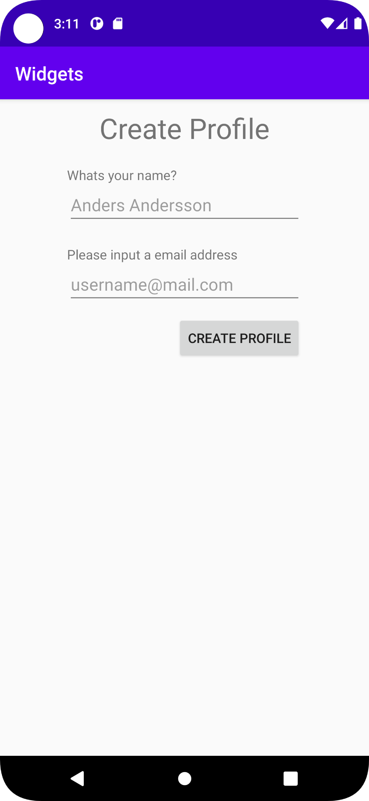
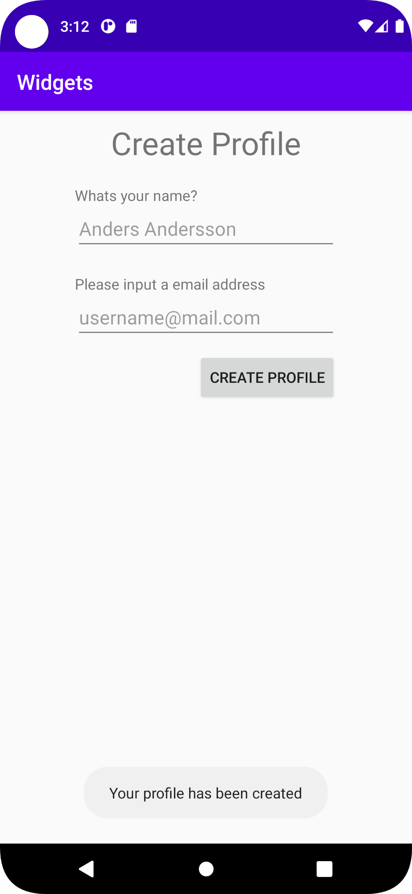

# Rapport

-Först skapades TextView och LinearLayout två widgets som styrs av deras "parent" ConstraintLayout.
-ConstraintLayout placerar sedan widgets:erna genom functioner så som ``app:layout_constraintTop_toTopOf="parent"`` som binder widgets till varandra.
-I LinearLayout skapas sedan ytterligare fyra widgets, två TextViews och två EditTexts som skapar "profil skaparen" som syns i bilderna nedan. 

-I LinearLayout skapas också en knapp, vilken om tryckt utnyttjar OnClickListener nedan.
-Vilken sedan kallar funktionen onButtonClick vilken skapar en toast (en popup ruta) för att informera användaren om att sin profil har skapats. 
``
button.setOnClickListener(new View.OnClickListener() {
    @Override
    public void onClick(View view) {
        onButtonClick();
    }
});
private void onButtonClick() {
    Toast.makeText(this, "Your profile has been created", Toast.LENGTH_LONG).show();
}
``

